## NYC Citibike-Data-Pipeline

### Overview:

This project was created as a part of the [2023 Data Engineering Zoomcamp edit by Hauct](https://github.com/hauct/de-zoomcamp.git) . The objective of this project is to establish a data pipeline for [NYC's Citibike data](https://s3.amazonaws.com/tripdata/index.html). It's designed as a batch pipeline, responsible for extracting data from NYC's Citibike Dataset and then storing the raw data in both [Google Cloud Storage](https://cloud.google.com/storage) and [Google BigQuery](https://cloud.google.com/bigquery). The data stored in BigQuery will undergo transformation using [DBT](https://www.getdbt.com/), and the resulting dataset will be leveraged by [Google Looker data studio](https://lookerstudio.google.com/u/0/navigation/reporting) for creating visualizations to support analytical purposes.

### Citibike Pipeline Architecture:

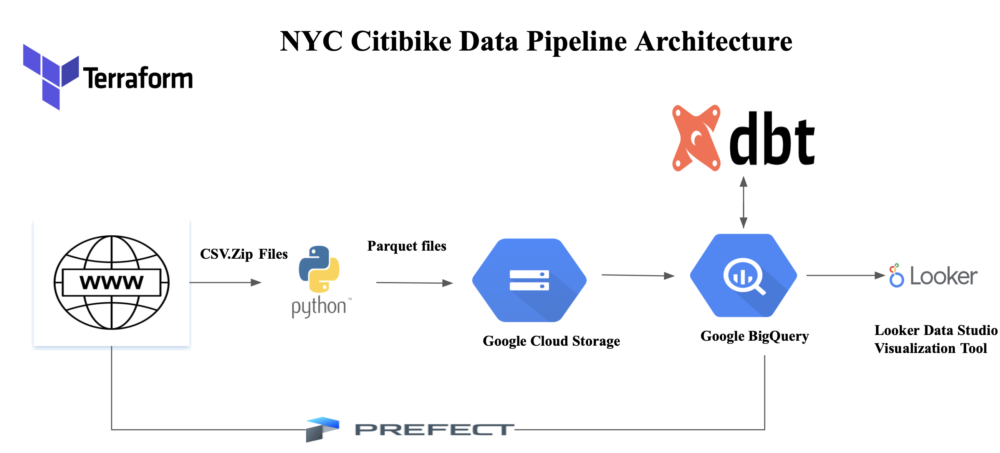

### Problem description:

Citi Bike represents New York City's official bike-sharing program, with the aim of providing residents and tourists with an enjoyable, cost-effective, and convenient alternative to walking, taxis, buses, and subways. Citi Bike firmly believes that cycling is the ultimate way to experience the beauty of NYC! It offers a swift and budget-friendly means to navigate the entire city, enabling riders to enjoy sightseeing along their journey.
This project addresses the following inquiries and assists cyclists in discovering the wonders of NYC:

Where do Citi Bike riders commonly travel?
Which stations see the highest levels of usage?
On which days of the week are most rides taken?
What is the total count of bike trips?

### Dashboard Samples: 


### Technologies:

Following technologies are used in implementing this pipeline

* Cloud: [Goggle Cloud Platform](https://cloud.google.com/)
  * Data Lake: [Google Cloud Storage](https://cloud.google.com/storage)
  * Data warehouse: [Google Big Query](https://cloud.google.com/bigquery)
* [Terraform](https://www.terraform.io/): Infrastructure as code (IaC) - creates project configuration for GCP to bypass cloud GUI.
* Workflow orchestration: [Prefect](https://www.prefect.io/)
* Data Transformation: [DBT](https://www.getdbt.com/)
* Data Visualisation: [Google Looker data studio](https://lookerstudio.google.com/u/0/navigation/reporting)

## Setup to run the project:

1. Clone the  git repo to your system
   ```bash
   git clone <your-repo-url>
   ```

2. Install the neccesary packages/pre-requisites for the project with the following command

   ```bash
     pip install -r requirements.txt
    ```

3. Next you need to setup your Google Cloud environment

- Create a Google Cloud Platform project, if you do not already have one. In my case, i created a project called `hauct-de-citibike-pipeline`

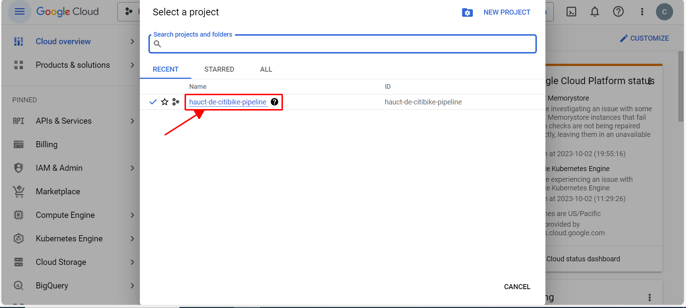

- Configure Identity and Access Management (`IAM`) for the `Service Account`, create one and provide the following privileges: 

<table>
<tr><td>
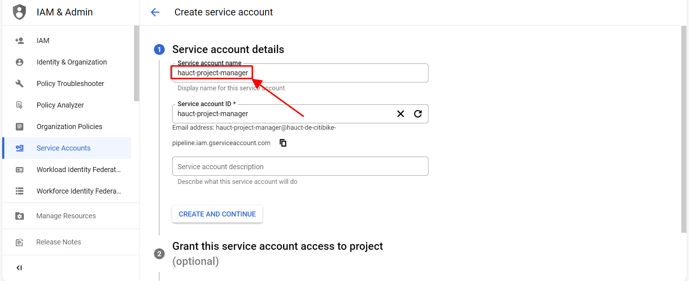
</td><td>
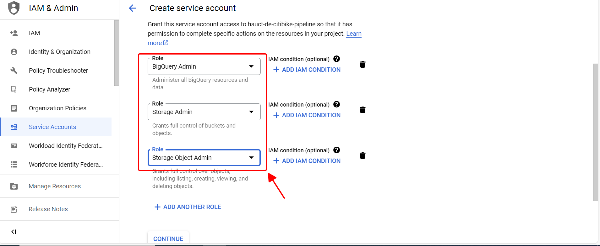
</td></tr>
</table>

- Download the JSON credentials and save it somehwere you'll remember, which will be JSON key.

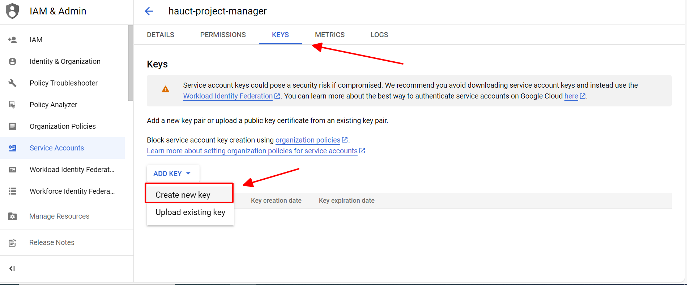

- Install the [Google Cloud SDK](https://cloud.google.com/sdk/docs/install-sdk)

- For Windows user, open your environment on Windows and add the location of your Google Cloud SDK bin in 'PATH' variables

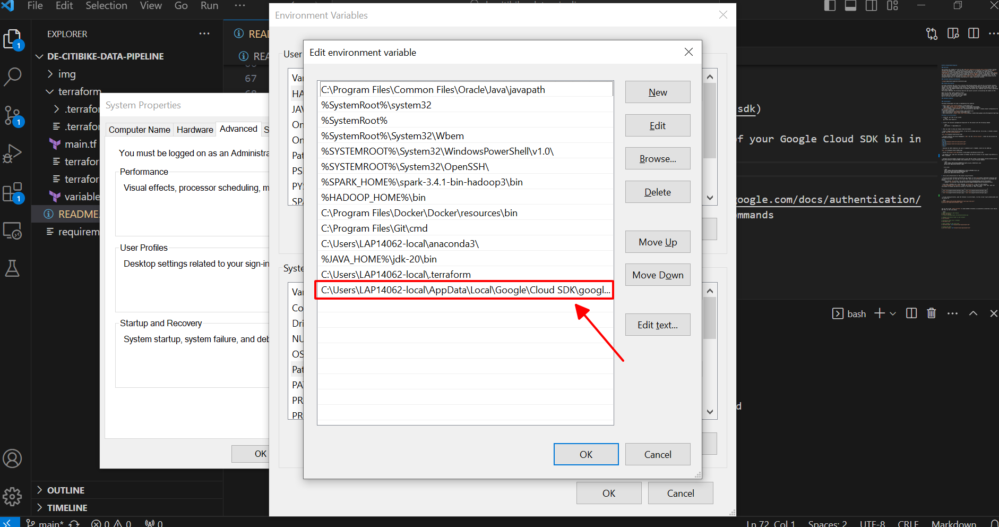

- Configure the environment variable point to your GCP key (https://cloud.google.com/docs/authentication/application-default-credentials#GAC) and authenticate it using following commands

```bash
  export GOOGLE_APPLICATION_CREDENTIALS=<path_to_your_credentials>.json
  gcloud auth application-default login
```

In my case:

```bash
  export GOOGLE_APPLICATION_CREDENTIALS=/c/Users/LAP14062-local/.gc/hauct-de-citibike-pipeline-0e76bd9c4f04.json
  gcloud auth application-default login
```

4. Set up the infrastructure of the project using Terraform

- If you do not have Terraform installed you can install it from [here](https://developer.hashicorp.com/terraform/downloads) and then add it to your PATH. There are two different settings for Linux/MacOS and Windows:
    - Linux/MacOS: [here](https://www.youtube.com/watch?v=ViMwnReV1A8&ab_channel=TobiasAbdon)
    - Windows: [here](https://www.youtube.com/watch?v=0qBoYu7x8mI&ab_channel=roseindiatutorials)

- In my case, a Windows user, after download `terraform.exe`, i put it on the location `C:\Users\LAP14062-local\.terraform` (create this folder if you haven't have). After that, open your environment on Windows and add the location of terrafrom in 'PATH' variables

|                                          |                                          |
|------------------------------------------|------------------------------------------|
| 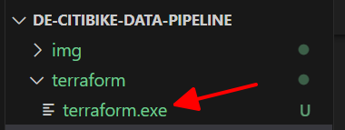 | 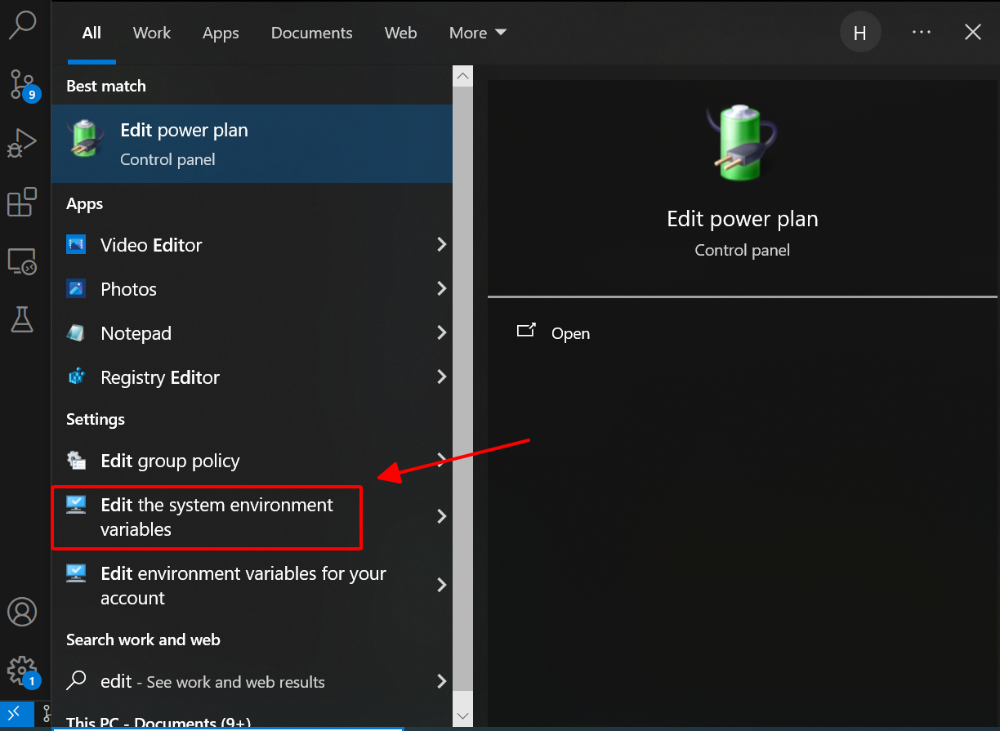 |
|------------------------------------------|------------------------------------------|
| 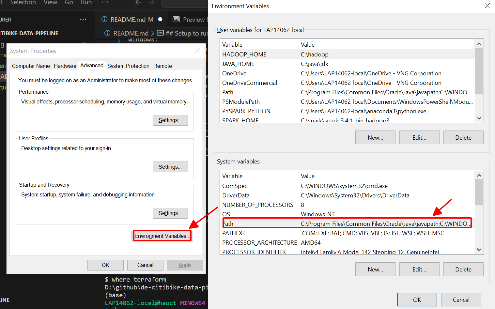 | 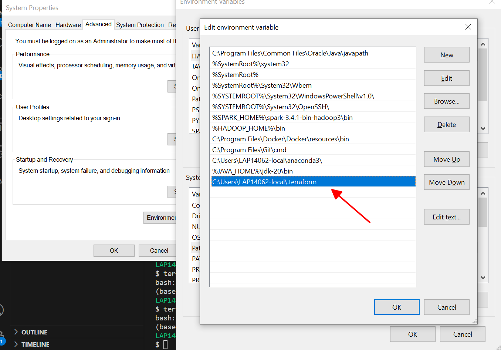 |


- In your working directory, open another the terminal (I use Git Bash), run the script `where terraform` to check whether terraform is successfully installed on your device.

- Change to `./terraform`. Here i created 2 files for setting terraform, [main](terraform/main.tf) and [variables](terraform/variables.tf)

- After that, run the scrip below:

```bash
# Initialize state file (.tfstate)
$ terraform init

# Check changes to new infra plan
$ terraform plan -var="project=<your-gcp-project-id>"

# Create new infra
$ terraform apply -var="project=<your-gcp-project-id>"
```

    In my case:

```bash
# Initialize state file (.tfstate)
$ terraform init

# Check changes to new infra plan
$ terraform plan -var="project=hauct-de-citibike-pipeline"

# Create new infra
$ terraform apply -var="project=hauct-de-citibike-pipeline"
```

Everything will be okay if you see this

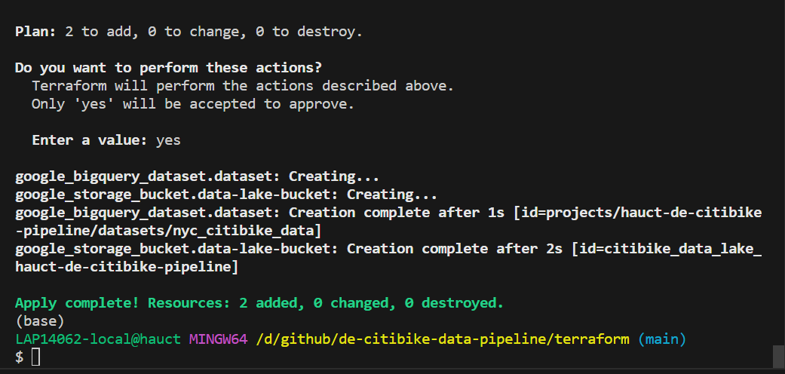

5. Run python code in Prefect folder

- You have installed the required python packages in step 1, prefect should be installed with it. Confirm the prefect installation with following command

```bash
  prefect --version
```

- You can start the prefect server so that you can access the UI using the command below:
```bash
prefect server start
```

- Access the UI at: `http://127.0.0.1:4200/` to view the UI

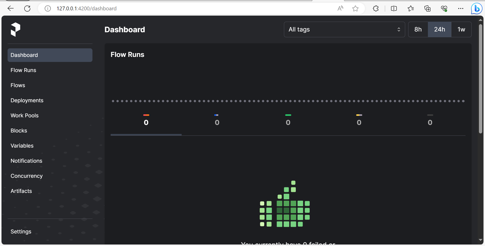

- Change out the blocks so that they are registered to your credentials for GCS and Big Query. This can be done in the Blocks options. 

  - Add block `GCP Credentials`, open your recently downloaded cred json (in my case: `hauct-de-citibike-pipeline-0e76bd9c4f04`) and copy to field `Service Account Info`

  <table>
  <tr><td>
  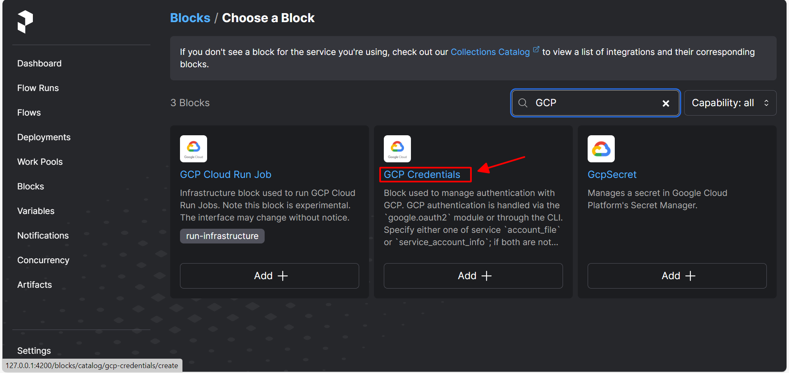
  </td><td>
  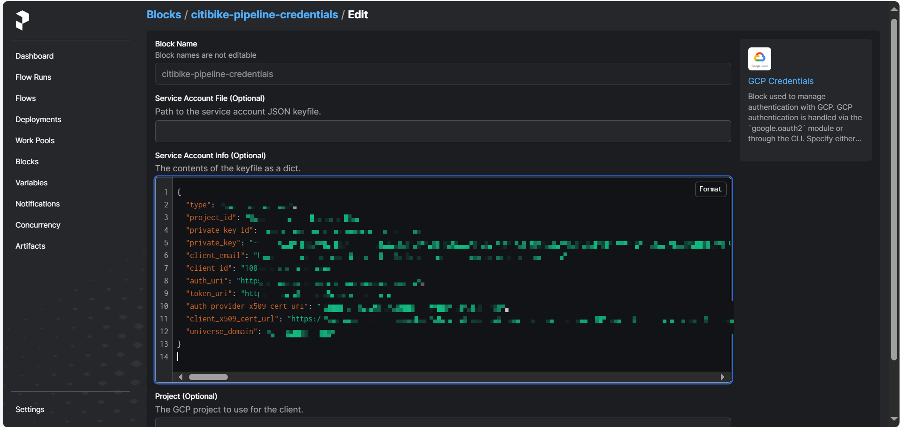
  </td></tr>
  </table>

  - Add block `GCS Bucket`, remember add-in your `GCP Credentials` block

  <table>
  <tr><td>
  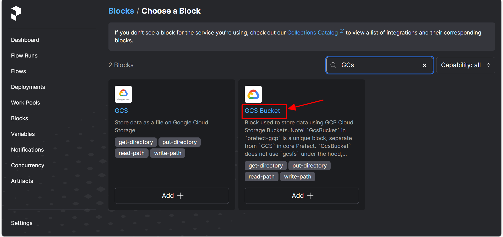
  </td><td>
  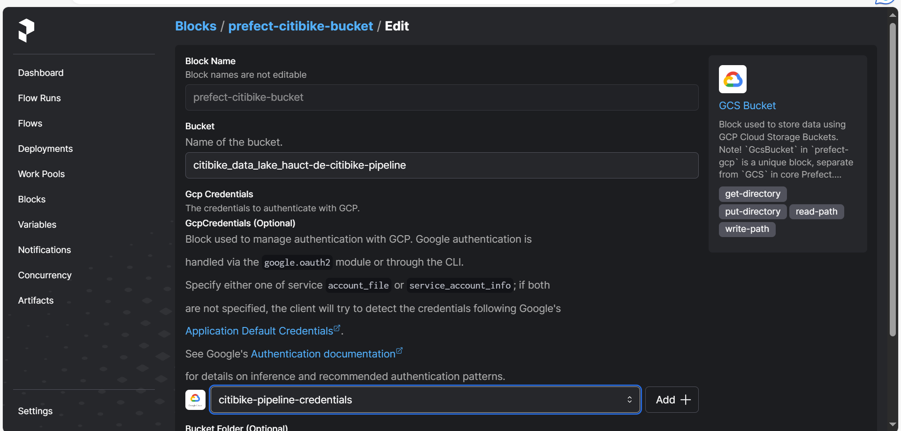
  </td></tr>
  </table>

- Go back to the terminal and run:
    ```bash
     cd prefect/
    ```

- then run
    ```bash
     python citibike_data_pipeline.py
    ```

- The python script will then store the citibike data both in your GCS bucket and in Big Query

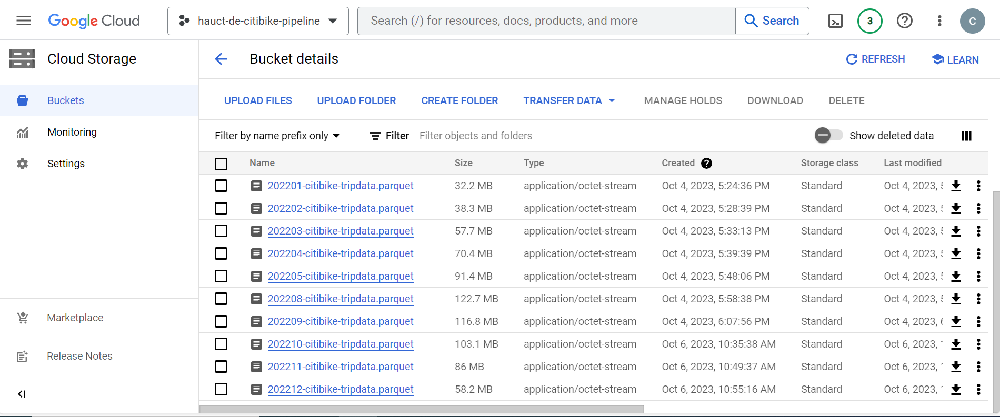

6. Running the dbt flow

- Create a dbt account and log in using dbt cloud [here](https://cloud.getdbt.com/).

- Once logged in clone the repo for use.

- in the cli at the bottom run the following command:
   ```bash
    dbt run
    ```

- this will run all the models and create the final dataset called "fact_citibike"

  <table>
  <tr><td>
  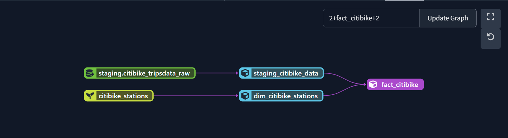
  </td><td>
  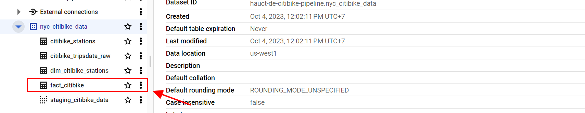
  </td></tr>
  </table>

7. Visualization

- The fact_citibike dataset is now available for you to integrate into Looker for graphical displays.

- The report is accessible at this [link]([https://lookerstudio.google.com/s/lUSsqr0LbT4](https://lookerstudio.google.com/reporting/843c48e3-85e1-4880-ac1b-77be4c9b0bfd))


